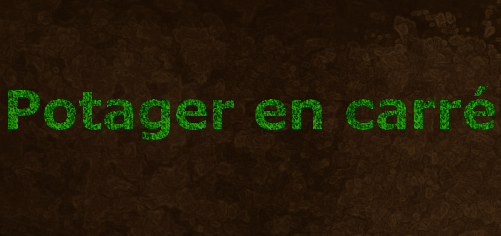
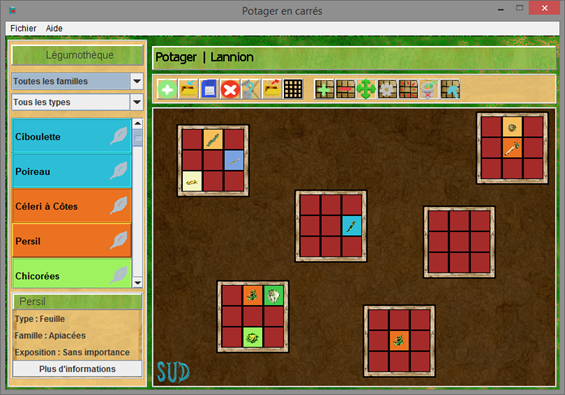
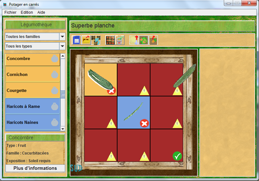

# Potager en carrés
> Projet étudiant de développement Java

  

Potager en carrés est un projet de développement en Java réalisé en 2014-2015 par une équipe de 4 étudiants en 2ème année de DUT Informatique.
L'objectif est de mettre en pratique les cours de Programmation Orientée Objet et de gestion de projet.

La méthode du jardinage en carrés est une technique de jardinage inventée aux États-Unis en 1980 par Mel Bartholomew. 
L’application se base sur différents codes ou expressions présents dans le livre **“Le guide pratique du potager en carrés : Tout pour planifier et cultiver” d’Anne-Marie Nageleisen**. 
Vous pouvez consulter son site, dédié aux potagers en carrés, à cette adresse : http://www.potagerencarres.info et obtenir plus d’informations sur les origines de cette méthode à cette adresse : http://www.potagerencarres.info/origines.html.

## Demo

## Fonctionnalités

* Gérer des jardins
* Placer des légumes issus de la légumothèque en XML issue du livre

  

* Aide à la décision pour la cohabitation et la rotation des légumes
* Gestion de l'ensoleillement
 

  

## Contributeurs

* Florian Federico
* Anthony Thomas
* Kevin Pin
* Mathieu Lochet
* Corentin Guillaume
* Fabien Odic
* Jérémy Tho

* Tuteur : Jean-Christophe Vialat

## Configuration

Version de java utilisée : 1.6

Système de compilation :
1. Compiler le projet avec eclipse (Si vous choisissez d'utiliser le MANIFEST existant, passez à l'étape 3)
2. Remplacer le MANIFEST.MF de l'archive jar par celui fourni dans les fichiers de données
3. Copier le dossier et fichier image/loading.png dans l'archive jar

Si le manifest n'est pas remplacé, le splash screen ne se lancera pas et il est possible que la librairie dom4j pose quelques problèmes, en fonction de la version du compilateur.  
L'absence du fichier loading.png provoquera un arrêt de l'application.

## Licence

Ce projet est sous licence GPL v3.

